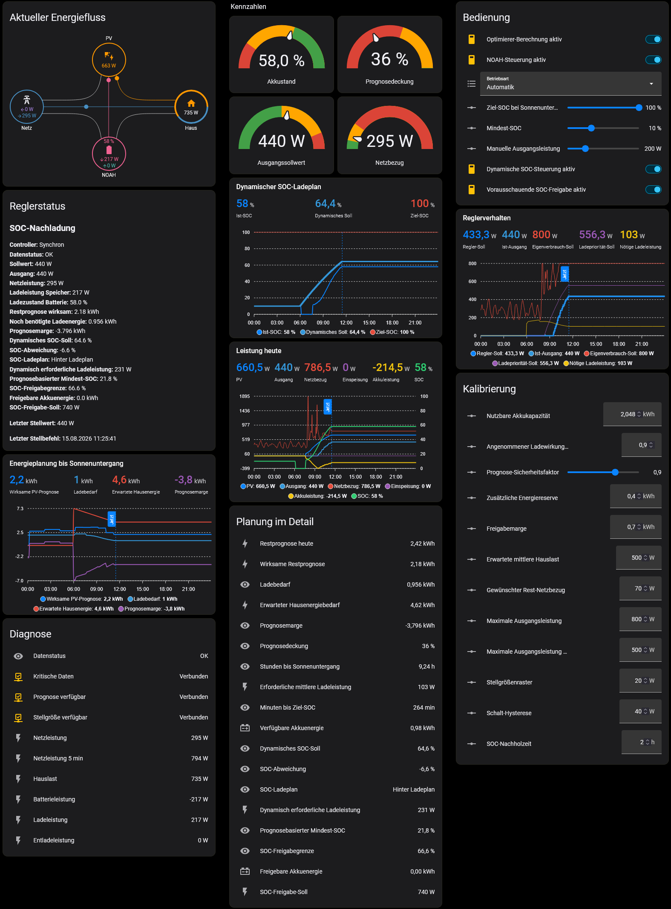
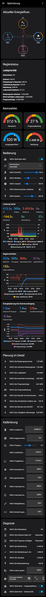

# Home Assistant Growatt NOAH Optimizer

Prognosebasierte Steuerung der Ausgangsleistung eines Growatt NOAH 2000
über Home Assistant und Noah-MQTT.

> **Status:** Beta. Die aktive Steuerung kann die NOAH-Ausgangsleistung
> verändern und sollte während der Testphase überwacht werden.

## Ziele

- Netzbezug reduzieren
- PV-Einspeisung bei nicht vollem Akku reduzieren
- Akku bis zum Abend auf einen konfigurierbaren Ziel-SOC laden
- Nachtentladung bis zu einem Mindest-SOC ermöglichen
- Wetterprognose über Forecast.Solar berücksichtigen
- vollständige Dashboardübersicht bereitstellen
- Energiefluss, Ladeplanung und Reglerverhalten transparent darstellen

---

## Dashboard

Der NOAH Optimizer stellt ab Beta 6 ein eigenes Home-Assistant-Dashboard
bereit.

Das Dashboard enthält unter anderem:

- aktuellen Energiefluss
- Netzbezug und Netzeinspeisung
- PV-Leistung
- Hauslast
- Lade- und Entladeleistung des NOAH
- Akku-SOC
- Ausgangssollwert
- Reglermodus
- Controllerstatus
- Prognosedeckung
- Energieplanung bis Sonnenuntergang
- Leistungsverläufe
- Reglerverhalten
- Optimizer-Einstellungen
- Kalibrierparameter
- Diagnosewerte

### Browseransicht



### Mobile Ansicht



> **Hinweis:** Die vorhandenen Screenshots können noch eine frühere
> Dashboard-Version zeigen. Das automatisch erzeugte Dashboard wurde ab
> Beta 6 vollständig an die HACS-Integration angepasst.

---

## Voraussetzungen

- Home Assistant
- HACS
- MQTT
- Noah-MQTT
- Forecast.Solar
- Sun-Integration
- saldierter Netzleistungssensor
- beschreibbare `number`-Entität für NOAH System Output Power

### Home-Assistant-Komponenten

- [HACS](https://www.hacs.xyz/)
- [Noah-MQTT](https://github.com/mtrossbach/noah-mqtt)
- [Forecast.Solar](https://www.home-assistant.io/integrations/forecast_solar/)

### Erforderliche HACS-Dashboardkarten

Für das vollständige Dashboard werden zusätzlich benötigt:

- [Power Flow Card Plus](https://github.com/flixlix/power-flow-card-plus)
- [ApexCharts Card](https://github.com/RomRider/apexcharts-card)

Die beiden Custom Cards werden nicht automatisch installiert.

Der Optimizer selbst funktioniert auch ohne diese Karten. Lediglich die
entsprechenden Dashboard-Elemente können dann nicht dargestellt werden.

---

## HACS-Installation

Eine HACS-kompatible Custom Integration ist als Beta verfügbar.

Aktuelle Beta:

```text
2.0.0-beta.7
```

Falls das Repository noch nicht in der regulären HACS-Suche verfügbar ist,
kann es als benutzerdefiniertes Repository hinzugefügt werden:

```text
https://github.com/CHLINDE/home-assistant-noah-optimizer
```

Typ:

```text
Integration
```

Danach **Growatt NOAH Optimizer** installieren und Home Assistant neu starten.

Die vollständige Anleitung befindet sich unter:

- [Installation](docs/installation.md)
- [Konfiguration](docs/configuration.md)
- [Fehlerbehebung](docs/troubleshooting.md)
- [HACS Integration Beta](docs/hacs-beta.md)

---

## Benötigte Quell-Entitäten

Beim Einrichten der Integration werden folgende vorhandene
Home-Assistant-Entitäten ausgewählt:

- saldierte Netzleistung
- NOAH Solar Power
- NOAH Output Power
- NOAH SOC
- NOAH Charging Power
- NOAH Discharge Power
- Forecast.Solar Restprognose heute
- NOAH System Output Power

`NOAH System Output Power` muss eine beschreibbare `number`-Entität sein.

### Unterstützte Einheiten

```text
Leistung: W oder kW
Energie:  Wh oder kWh
SOC:      %
```

### Netzvorzeichen

Die erwartete Konvention lautet:

```text
positiv = Netzbezug
negativ = Netzeinspeisung
```

Bei umgekehrter Konvention kann während der Einrichtung:

```text
Netzvorzeichen umkehren
```

aktiviert werden.

---

## Optimizer-Berechnung

Die Integration berechnet unter anderem:

- Netzbezug
- Netzeinspeisung
- Hauslast
- Batterieleistung
- 5-Minuten-Mittelwert der Netzleistung
- verbleibende Zeit bis Sonnenuntergang
- verfügbare Akkuenergie
- benötigte Ladeenergie
- wirksame PV-Restprognose
- erwarteten Hausenergiebedarf
- Prognosemarge
- Prognosedeckung
- erforderliche mittlere Ladeleistung
- verbleibende Zeit bis Ziel-SOC
- Eigenverbrauch-Sollwert
- Ladeprioritäts-Sollwert
- Reglermodus
- endgültigen Ausgangssollwert

Die Berechnungslogik wurde in Beta 4 gegen den bisherigen YAML-Optimizer
verglichen.

Bei identischen Einstellungen stimmten die relevanten Berechnungsergebnisse,
der Reglermodus und der endgültige Ausgangssollwert mit der YAML-Version
überein.

---

## Betriebsarten

Der Optimizer unterstützt:

```text
Automatik
Eigenverbrauch
Ladepriorität
Manuell
```

### Automatik

Die Betriebsart wird abhängig von unter anderem:

- SOC
- Ziel-SOC
- Mindest-SOC
- Restprognose
- Prognosemarge
- erwarteter Hauslast
- Netzleistung
- verbleibender Zeit bis Sonnenuntergang

automatisch gewählt.

### Eigenverbrauch

Die Ausgangsleistung wird so geregelt, dass der Netzbezug möglichst reduziert
wird.

### Ladepriorität

Ein Teil der verfügbaren PV-Leistung wird für das Erreichen des Ziel-SOC
reserviert.

### Manuell

Die konfigurierte manuelle Ausgangsleistung wird als Sollwert verwendet.

---

## Aktive Steuerung

Seit Beta 5 kann der berechnete Ausgangssollwert optional aktiv an:

```text
NOAH System Output Power
```

übertragen werden.

Die Integration besitzt dafür zwei bewusst getrennte Schalter:

```text
Optimierer-Berechnung aktiv
NOAH-Steuerung aktiv
```

Die aktive NOAH-Steuerung ist standardmäßig ausgeschaltet.

Dadurch kann die vollständige Optimizer-Berechnung zunächst beobachtet und
geprüft werden, ohne Stellbefehle an den NOAH zu senden.

### Schutzmechanismen

Der aktive Controller enthält:

- konfigurierbare Schalt-Hysterese
- Stellgrößenraster
- Mindestabstand zwischen normalen Stellbefehlen
- Wiederholungsversuch bei nicht übernommenem Sollwert
- Failsafe bei längerem Verlust kritischer Messdaten
- persistente Home-Assistant-Benachrichtigung
- Sperre gegen den alten YAML-Controller

### Controllerdiagnose

Der Schalter **NOAH-Steuerung aktiv** stellt zusätzliche Attribute bereit:

```text
control_status
last_command_target
last_command_at
```

Typische `control_status`-Werte sind:

```text
disabled
optimizer_disabled
legacy_controller_active
critical_data_missing
actuator_unavailable
target_unavailable
rate_limited
waiting_for_retry
in_sync
command_sent
command_failed
failsafe
```

`in_sync` ist der normale Ruhezustand, wenn berechneter Sollwert und aktuelle
NOAH-Stellgröße innerhalb der eingestellten Hysterese liegen.

---

## Failsafe

Fehlen kritische Messwerte länger als zehn Minuten, während die aktive
Steuerung eingeschaltet ist:

1. Home Assistant erzeugt eine persistente Benachrichtigung.
2. Ist NOAH System Output Power erreichbar, versucht der Optimizer die
   Stellgröße auf `0 W` zu setzen.
3. Ist die Stellgröße nicht erreichbar, wird die Warnung trotzdem erzeugt.
4. Nach Wiederkehr der kritischen Messwerte wird der Failsafe zurückgesetzt
   und die Benachrichtigung entfernt.

---

## Dashboard ab Beta 6

Seit Beta 6 erzeugt die Integration beim ersten Start ein eigenes
Lovelace-Dashboard mit dem Seitenleisteneintrag:

```text
NOAH Optimizer
```

### Seitenleiste

Bei einer Neuinstallation kann im Einrichtungsdialog ausgewählt werden, ob
das Dashboard in der Seitenleiste erscheinen soll.

Standard:

```text
Ein
```

Bei einem Update von einer älteren Beta, in der diese Einstellung noch nicht
existierte, wird ebenfalls **Ein** verwendet.

### Dynamische Entity-IDs

Die Integration löst ihre eigenen Entity-IDs über die Home-Assistant
Entity Registry auf.

Dadurch müssen Bereichspräfixe wie beispielsweise:

```text
terrasse_
balkon_
keller_
```

nicht fest in der Dashboard-Datei eingetragen werden.

Auch vom Benutzer geänderte Entity-IDs können dadurch berücksichtigt werden.

### Dashboard-Sprache

Bei der erstmaligen Erstellung wird die Standardsprache anhand der
Home-Assistant-Sprache gewählt:

```text
Deutsch                 → dashboard_de.yaml
alle anderen Sprachen   → dashboard_en.yaml
```

Ein späterer Sprachwechsel überschreibt ein bereits vorhandenes oder vom
Benutzer angepasstes Dashboard nicht.

### Benutzeränderungen

Das Standard-Dashboard wird nur initial angelegt.

Eigene Änderungen am Dashboard werden bei:

- Home-Assistant-Neustarts
- Reloads der Integration
- späteren Updates

nicht automatisch überschrieben.

---

## Energiefluss

Power Flow Card Plus stellt Netz und Batterie mit getrennten Flussrichtungen
dar.

### Netz

```text
Netzbezug       = Energie aus dem Netz
Netzeinspeisung = Energie ins Netz
```

### NOAH-Speicher

```text
Ladeleistung    = Energie fließt in den Akku
Entladeleistung = Energie fließt aus dem Akku
```

Für Power Flow Card Plus verwendet der NOAH deshalb:

```text
consumption = Entladeleistung
production  = Ladeleistung
```

Damit entspricht die grafisch dargestellte Richtung dem tatsächlichen
Energiefluss des Speichers.

---

# Versionshistorie

## Version 2.0.0-beta.1

Die erste HACS-Beta war ausschließlich für den Beobachtungsbetrieb vorgesehen.

Sie:

- liest vorhandene Home-Assistant-Entitäten
- normalisiert W/kW und Wh/kWh
- berechnet Netzbezug und Netzeinspeisung
- berechnet Hauslast und Batterieleistung
- prüft die Verfügbarkeit von Forecast.Solar
- prüft die Verfügbarkeit von NOAH System Output Power
- sendet keine Stellbefehle an den NOAH

Die Beta konnte deshalb parallel zum bestehenden YAML-Optimizer betrieben
werden.

---

## Version 2.0.0-beta.2

Beta 2 konzentrierte sich auf die Integrationsstruktur und den
HACS-Updatepfad.

Änderungen:

- Integrationstyp von `helper` auf `device` geändert
- bessere Sichtbarkeit unter **Einstellungen → Geräte & Dienste**
- vorhandener Konfigurationseintrag bleibt bei HACS-Updates erhalten
- ausgewählte Quell-Entitäten bleiben bei Updates erhalten
- vorhandene Entitäten werden nicht dupliziert
- Updatepfad von `2.0.0-beta.1` auf `2.0.0-beta.2` getestet

Der Optimizer blieb in dieser Version ausschließlich im Beobachtungsmodus.

`2.0.0-beta.2` schrieb noch nicht auf NOAH System Output Power.

---

## Version 2.0.0-beta.3

Beta 3 portierte die vollständige Berechnungslogik des bisherigen
YAML-Optimizers nach Python.

Berechnet wurden unter anderem:

- prognosebasierter Ladebedarf
- erwarteter Hausenergiebedarf
- Prognosemarge
- Prognosedeckung
- Eigenverbrauch-Sollwert
- Ladeprioritäts-Sollwert
- Reglermodus
- endgültiger NOAH-Ausgangssollwert

Der berechnete Ausgangssollwert war weiterhin ausschließlich zur Beobachtung
bestimmt.

`2.0.0-beta.3` schrieb nicht auf NOAH System Output Power und konnte deshalb
weiterhin mit dem aktiven YAML-Optimizer verglichen werden.

---

## Version 2.0.0-beta.4

Beta 4 korrigierte den Integrationsfehler aus Beta 3, der durch die fehlende
`select.py`-Plattform verursacht wurde.

Änderungen:

- fehlende `select.py` ergänzt
- erfolgreiches Laden der Integration wiederhergestellt
- Betriebsart-Auswahl wiederhergestellt
- bestehender Konfigurationseintrag bleibt erhalten
- ausgewählte Quell-Entitäten bleiben erhalten
- Berechnungslogik gegen den Legacy-YAML-Optimizer geprüft

Die berechneten Werte wurden mit dem alten YAML-Optimizer verglichen.

Bei identischen Einstellungen stimmten:

- Ladebedarf
- wirksame Restprognose
- erwarteter Hausenergiebedarf
- Prognosemarge
- Prognosedeckung
- erforderliche mittlere Ladeleistung
- Eigenverbrauch-Soll
- Ladepriorität-Soll
- Ausgangssollwert
- Reglermodus

mit der YAML-Implementierung überein.

Beta 4 blieb weiterhin ausschließlich im Beobachtungsmodus.

---

## Version 2.0.0-beta.5

Beta 5 führte die optionale aktive NOAH-Steuerung ein.

Die aktive Steuerung:

- ist standardmäßig deaktiviert
- verwendet den berechneten Ausgangssollwert
- berücksichtigt die konfigurierte Schalt-Hysterese
- begrenzt die Häufigkeit normaler Stellbefehle
- wiederholt einen Sollwert, wenn NOAH ihn nicht übernommen hat
- aktiviert nach längerem Verlust kritischer Messdaten einen Failsafe
- erzeugt eine persistente Home-Assistant-Benachrichtigung
- blockiert Stellbefehle, solange der Legacy-YAML-Optimizer noch aktiv ist

Zusätzlich wurden getrennte Schalter eingeführt:

```text
Optimierer-Berechnung aktiv
NOAH-Steuerung aktiv
```

Damit kann die Berechnung unabhängig von der aktiven Stellregelung betrieben
werden.

---

## Version 2.0.0-beta.6

Beta 6 führte das automatisch erzeugte Lovelace-Dashboard für die
HACS-Integration ein.

Neu:

- eigenes NOAH-Optimizer-Dashboard
- standardmäßige Anzeige in der Home-Assistant-Seitenleiste
- optionale Sidebar-Auswahl bei der Ersteinrichtung
- dynamische Auflösung der tatsächlichen Entity-IDs
- Unterstützung von durch Bereiche veränderten Entity-IDs
- deutsche Dashboard-Vorlage
- englische Dashboard-Vorlage
- aktueller Energiefluss über Power Flow Card Plus
- Netzbezug und Netzeinspeisung getrennt
- Laden und Entladen des Speichers getrennt
- Controllerstatus und Diagnose
- Energieplanung bis Sonnenuntergang
- Leistungs- und Reglerdiagramme über ApexCharts
- Kalibrierparameter direkt im Dashboard

Die Dashboard-Konfiguration wird nur initial erzeugt. Spätere Änderungen des
Benutzers werden nicht automatisch überschrieben.

---

## Version 2.0.0-beta.7

Beta 7 korrigiert die Richtung des Batterie-Energieflusses in Power Flow Card
Plus.

In Beta 6 wurden Lade- und Entladeleistung in der grafischen Darstellung des
NOAH vertauscht.

### Behoben

- Ladeleistung wurde als Energiefluss aus dem Akku dargestellt
- Entladeleistung wurde als Energiefluss in den Akku dargestellt
- Zuordnung in `dashboard_de.yaml` korrigiert
- Zuordnung in `dashboard_en.yaml` korrigiert
- Zuordnung im Legacy-Dashboard korrigiert
- zugehörige Dokumentation korrigiert

Für Power Flow Card Plus gilt seit Beta 7 korrekt:

```text
consumption = Entladeleistung
production  = Ladeleistung
```

Damit wird:

```text
Ladeleistung    → Energie zum NOAH
Entladeleistung → Energie vom NOAH
```

grafisch korrekt dargestellt.

---

## Legacy-YAML-Installation

Die ältere Package-Variante bleibt im Repository erhalten.

Dateien:

```text
noah_optimizer.yaml
dashboards/noah_dashboard.yaml
```

### Installation

1. `noah_optimizer.yaml` nach `/config/packages/` kopieren.
2. Alle Platzhalter-Entity-IDs ersetzen.
3. Package-Unterstützung in `configuration.yaml` aktivieren.
4. Unter **Werkzeuge → YAML** die Konfiguration prüfen.
5. Home Assistant neu starten.
6. Legacy-Dashboard importieren.
7. Optimizer zunächst ausgeschaltet testen.

Die ausführliche Anleitung befindet sich unter:

- [Installation](docs/installation.md)
- [Konfiguration](docs/configuration.md)
- [Fehlerbehebung](docs/troubleshooting.md)

Für neue Installationen wird die HACS-Integration empfohlen.

---

## Legacy-YAML-Sperre

Legacy-YAML-Optimizer und HACS-Controller dürfen niemals gleichzeitig aktiv
denselben NOAH steuern.

Die HACS-Integration prüft deshalb:

```text
input_boolean.noah_optimizer_enabled
```

Ist dieser Helfer vorhanden und steht auf `on`, blockiert die HACS-Integration
normale Stellbefehle.

Vor Aktivierung der HACS-Steuerung muss deshalb gelten:

```text
Legacy YAML Optimizer = Aus
NOAH-Steuerung aktiv  = Ein
```

---

## Wichtiger Sicherheitshinweis

Versionen `2.0.0-beta.1` bis einschließlich `2.0.0-beta.4` waren
ausschließlich für den Beobachtungsbetrieb vorgesehen.

Seit `2.0.0-beta.5` kann die Integration optional die NOAH-Ausgangsleistung
aktiv verändern.

Die aktive Steuerung ist standardmäßig deaktiviert und muss ausdrücklich
eingeschaltet werden.

Vor der Aktivierung sollten geprüft werden:

- Netzleistung und Netzvorzeichen
- PV-Leistung
- NOAH-Ausgangsleistung
- Ladezustand
- Ladeleistung
- Entladeleistung
- Forecast.Solar-Restprognose
- berechneter Ausgangssollwert
- Beschreibbarkeit von NOAH System Output Power

Legacy-YAML-Optimizer und HACS-Controller dürfen niemals gleichzeitig
denselben NOAH aktiv steuern.

---

## Wichtiger Hinweis

Die Steuerung verwendet die inoffizielle Noah-MQTT-Anbindung und ist keine
offizielle Growatt-Lösung.

Dieses Projekt ist ein Community-Projekt und steht in keiner offiziellen
Verbindung zu Growatt.

Die Nutzung erfolgt auf eigene Verantwortung.

---

## Projektstruktur

```text
home-assistant-noah-optimizer/
├── .github/
│   └── workflows/
│       ├── hacs.yml
│       └── hassfest.yml
├── custom_components/
│   └── noah_optimizer/
│       ├── translations/
│       │   ├── de.json
│       │   └── en.json
│       ├── __init__.py
│       ├── binary_sensor.py
│       ├── config_flow.py
│       ├── const.py
│       ├── control.py
│       ├── coordinator.py
│       ├── dashboard.py
│       ├── dashboard_de.yaml
│       ├── dashboard_en.yaml
│       ├── entity.py
│       ├── manifest.json
│       ├── number.py
│       ├── select.py
│       ├── sensor.py
│       └── switch.py
├── dashboards/
│   └── noah_dashboard.yaml
├── docs/
│   ├── configuration.md
│   ├── hacs-beta.md
│   ├── installation.md
│   └── troubleshooting.md
├── screenshots/
│   ├── noah_dashboard_browser.png
│   └── noah_dashboard_iPhone.jpeg
├── CHANGELOG.md
├── LICENSE
├── README.md
├── THIRD_PARTY.md
├── hacs.json
└── noah_optimizer.yaml
```

---

## Lizenz

Dieses Projekt steht unter der MIT License.

Siehe:

- [LICENSE](LICENSE)
- [THIRD_PARTY.md](THIRD_PARTY.md)